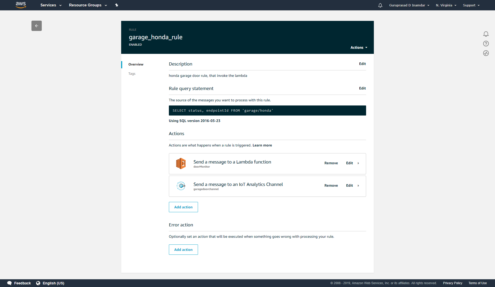

# doormonitor-lambda
Alexa Contact Sensor - Lambda function

## Desciption
You can use your Sensor e.g. ESP32 that publishses the event to AWS IoT topic for e.g. 'garage/honda' with message as 
``` 
{ status: "OPEN", endpointId: "xxx-xxx" }
``` 
everytime the door opens. Using AWS IoT, rule (Act) you can invoke this lambda function in your AWS. This function then find the user profile using endpointId to get the auth token from DynamoDB table and call the Alexa event gateway api. This function also takes care of refreshing the token for each user if needed. The end user then can use the the device to create a new routine, where Alexa can announce the door open event or send a notification to mobile devices.

## Screenshots

 


## References
https://developer.amazon.com/blogs/alexa/post/bda9d70c-2f0d-454d-9939-2eb82868cf35/announcing-contact-and-motion-sensor-apis-and-integration-into-alexa-routines-adding-new-home-automation-features-for-customers-and-new-opportunities-for-smart-home-developers

https://developer.amazon.com/docs/smarthome/build-smart-home-skills-for-sensors.html

